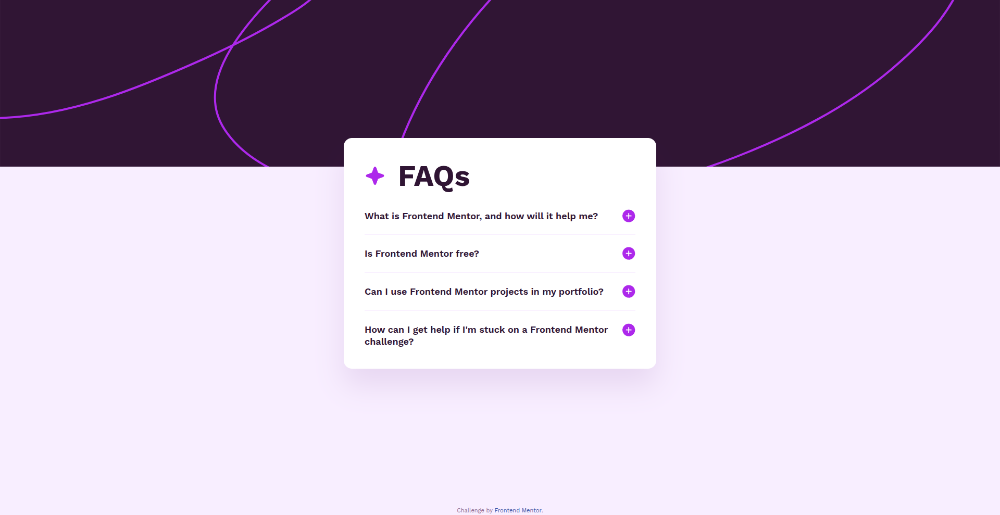

# Frontend Mentor - FAQ accordion solution

This is a solution to the [FAQ accordion challenge on Frontend Mentor](https://www.frontendmentor.io/challenges/faq-accordion-wyfFdeBwBz).

## Overview

A responsive FAQ accordion, where users can:

- Hide/Show the answer to a question when the question is clicked
- Navigate the questions and hide/show answers using keyboard navigation alone
- View the optimal layout for the interface depending on their device's screen size
- See hover and focus states for all interactive elements on the page

### Screenshot

### Links

- https://biruchenko.github.io/faq-accordion/

### Built with

- Semantic HTML5
- SCSS (Sass) — compiled to CSS
- Flexbox
- Vanilla JavaScript (DOM manipulation)

## Acknowledgments

- Challenge by [Frontend Mentor](https://www.frontendmentor.io).
